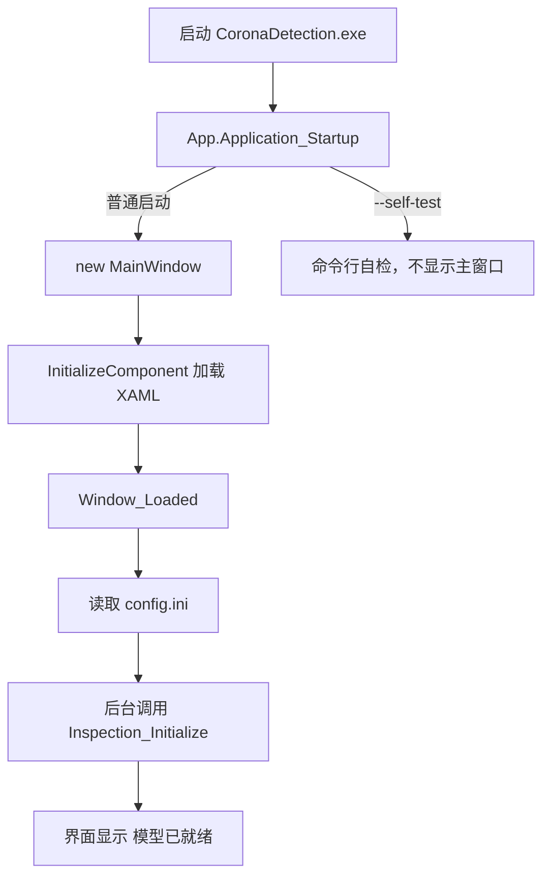

# Corona 瑕疵检测上位机：从 C++ 到 WPF 的学习指南

这份文档面向已经会 C++，但还不熟悉 C#、XAML 和 WPF 的开发者。建议一边阅读，
一边打开对应源码。不要一开始就试图记住所有语法，先建立“界面如何走到 DLL”的整体认识。

## 1. 这个项目由什么组成

整个程序可以分成四层：

```text
XAML 界面
  ↓ 点击事件、数据绑定
MainWindow.xaml.cs（界面流程）
  ↓ 调用业务包装
InspectionEngine.cs（C# 资源管理和结果转换）
  ↓ P/Invoke
NativeMethods.cs → Corona_defect_detection.dll → C++ InspectionEngine
```

主要文件如下：

```text
windows_corona_detection/
├─ CMakeLists.txt                         WPF 项目的 CMake 构建入口
├─ Runtime/                               原生 DLL、config.ini 和模型
├─ CoronaDetection.App/
│  ├─ App.xaml                            全局 WPF 资源和应用入口声明
│  ├─ App.xaml.cs                         程序启动、命令行自检、全局异常处理
│  ├─ MainWindow.xaml                     窗口布局、控件、样式、数据列
│  ├─ MainWindow.xaml.cs                  界面事件和完整检测流程
│  ├─ NativeMethods.cs                    C DLL 函数和 C 结构体的 C# 声明
│  ├─ InspectionEngine.cs                 DLL 句柄生命周期及结果转换
│  ├─ IniDocument.cs                      config.ini 的读取、编辑和保存
│  ├─ DetectionFiles.cs                   图片枚举、输出路径、CSV 保存
│  └─ CoronaDetection.App.csproj          .NET/WPF、版本、图标和发布资源
└─ package/                               生成的便携发布目录，不提交 Git
```

仓库根目录还有两个常用脚本：

- `build_windows_app.bat`：编译 C++ DLL，再编译 WPF 上位机。
- `package_windows_app.bat`：生成包含 .NET、原生 DLL 和必要模型的便携目录。

## 2. 先用 C++ 思维理解 C#

| C# 写法 | 可以先类比成 |
|---|---|
| `class` | C++ 类 |
| `interface` | 只有抽象接口的 C++ 类 |
| `string` | `std::string`，但由 .NET 管理 |
| `List<T>` | `std::vector<T>` |
| `Dictionary<K,V>` | `std::unordered_map<K,V>` |
| `var x = ...` | 类似 C++ `auto x = ...` |
| `T?` | 这个引用或值允许为空 |
| `new()` | 编译器从左侧类型推断构造类型 |
| `obj.Property` | C# 属性，外观像字段，内部可包含 getter/setter |
| `=>` | 简短函数或 Lambda，类似 C++ Lambda/单行函数 |
| `record` | 偏数据用途的类，自动生成比较、构造等功能 |
| `using var x = ...` | 作用域结束调用 `Dispose()`，类似 RAII |
| `lock (obj)` | 互斥锁作用域，类似 `std::lock_guard` |
| `async/await` | 异步状态机；等待期间不阻塞 UI 线程 |

C# 大多数普通对象由垃圾回收器管理，不需要手动 `delete`。但是 DLL 句柄、文件句柄等
非托管资源不能只靠垃圾回收，所以仍然要实现 `IDisposable`。本项目中的
`InspectionEngine.Dispose()` 就相当于显式释放 C++ 资源。

## 3. WPF、XAML 和 C# 分别负责什么

WPF 是 Windows 桌面 UI 框架。XAML 是描述界面的 XML，C# 负责行为。

下面是一段典型 XAML：

```xml
<Button x:Name="StartButton"
        Content="开始检测"
        Click="Start_Click"/>
```

它表达三件事：

1. 创建一个按钮。
2. 用 `x:Name="StartButton"` 给 C# 一个可访问的成员名。
3. 点击时调用 `MainWindow.xaml.cs` 中的 `Start_Click`。

对应的 C#：

```csharp
private async void Start_Click(object sender, RoutedEventArgs e)
{
    // 检测流程
}
```

`MainWindow.xaml` 和 `MainWindow.xaml.cs` 都声明了同一个
`CoronaDetection.MainWindow`。关键字 `partial` 表示一个类可以拆在多个文件中。
编译时，XAML 会生成另一部分 C# 代码；构造函数中的 `InitializeComponent()` 会创建
所有控件、加载资源并连接事件。

因此可以这样记：

```text
XAML = 对象树和初始属性
C# code-behind = 事件和运行时逻辑
```

本项目采用容易入门的 code-behind 结构，没有强行引入完整 MVVM。项目变得更大以后，
可以再学习 MVVM，把界面状态和业务逻辑进一步拆开。

## 4. 程序启动流程



启动入口在 `App.xaml`：

```xml
Startup="Application_Startup"
```

实际处理在 `App.xaml.cs`：

```csharp
MainWindow = new MainWindow();
MainWindow.Show();
```

窗口显示后触发 `Window_Loaded`。它先读取配置，再执行：

```csharp
await Task.Yield();
await RestartModelAsync();
```

`Task.Yield()` 让 WPF 先把窗口绘制出来，然后再加载模型，避免用户启动程序时长时间只看到
一个没有响应的空窗口。

## 5. XAML 布局怎么看

WPF 最常用的布局容器是 `Grid`。它类似一个可以定义行列的表格：

```xml
<Grid>
    <Grid.RowDefinitions>
        <RowDefinition Height="Auto"/>
        <RowDefinition Height="*"/>
    </Grid.RowDefinitions>
</Grid>
```

- `Auto`：按内容需要的大小分配。
- `*`：占用剩余空间。
- `2*`：在剩余空间中占两份。
- `Grid.Row="1"`：把控件放到第二行。
- `Grid.ColumnSpan="3"`：横跨三列。

本窗口的根布局分为顶部标题栏和下面的 `TabControl`。检测任务、模型配置分别放在不同
`TabItem` 中。窗口使用：

```xml
WindowState="Maximized"
ResizeMode="CanResize"
```

所以默认最大化，同时允许用户缩放。

常用控件：

- `TextBox`：路径和文本输入。
- `Button`：触发事件。
- `RadioButton`：单张/批量二选一。
- `CheckBox`：递归、保存图片、保留目录结构等布尔选项。
- `ComboBox`：图片格式下拉列表。
- `ProgressBar`：检测进度。
- `DataGrid`：配置和结果表格。
- `TextBlock`：只读说明和状态。

全局样式写在 `App.xaml` 的 `Application.Resources` 中。例如给所有按钮统一高度，
不需要每个按钮重复填写。

## 6. C# 怎样调用 C++ DLL

### 6.1 C ABI 是边界

C# 不直接调用 C++ 类，而是调用 `inference_c_api.h` 暴露的 C 函数。这样避免 C++ 类布局、
名字修饰和不同编译器 ABI 的问题。

C++：

```cpp
int32_t Inspection_ProcessImagePathTimed(
    InspectionHandle handle,
    const char* image_path,
    InspectionResultC* out_result,
    double o_inference_ms[1]);
```

C# 在 `NativeMethods.cs` 中写出对应声明：

```csharp
[DllImport("Corona_defect_detection.dll",
    CallingConvention = CallingConvention.Cdecl,
    CharSet = CharSet.Ansi)]
internal static extern int Inspection_ProcessImagePathTimed(
    IntPtr handle,
    [MarshalAs(UnmanagedType.LPStr)] string imagePath,
    ref InspectionResult result,
    out double inferenceMs);
```

对应关系：

| C/C++ | C# P/Invoke |
|---|---|
| `void*` 句柄 | `IntPtr` |
| `const char*` | `string` + `LPStr` |
| `int32_t` | `int` |
| `float` | `float` |
| `double*` 输出 | `out double` |
| 结构体指针 | `ref InspectionResult` |

`CallingConvention.Cdecl` 必须与 DLL 一致。字段顺序、类型宽度、固定数组长度也必须完全一致，
否则不是普通逻辑错误，而是可能直接读错内存。

### 6.2 结构体封送

`InspectionResultC` 在 C# 中对应 `InspectionResult`：

```csharp
[StructLayout(LayoutKind.Sequential, CharSet = CharSet.Ansi)]
internal struct InspectionResult
```

`LayoutKind.Sequential` 表示字段按声明顺序排列。固定长度数组使用：

```csharp
[MarshalAs(UnmanagedType.ByValArray, SizeConst = MaxDetections)]
public InspectionDetection[] Details;
```

调用前必须创建数组：

```csharp
var native = NativeMethods.InspectionResult.Create();
```

如果只写 `new InspectionResult()` 而没有初始化 `Details`，封送时就可能失败。

### 6.3 为什么还有 InspectionEngine.cs

理论上 `MainWindow` 可以直接调用 `NativeMethods`，但那会让 UI 代码同时承担句柄管理、
错误码处理和结构体转换。`InspectionEngine.cs` 是中间适配层：

```text
MainWindow 只关心 DetectionResult
InspectionEngine 管理 IntPtr、状态码和 Dispose
NativeMethods 只描述 DLL 原始接口
```

这和 C++ 中给底层 C API 再包一层 RAII 类是同一个思路。

## 7. DLL 句柄的完整生命周期

初始化流程：

```text
Inspection_Create
  ↓
Inspection_Initialize(config.ini)
  ↓
多次 Process...
  ↓
Inspection_Release
  ↓
Inspection_Destroy
```

`InspectionEngine.Initialize()` 会先调用 `CloseHandle()`，再重新创建和初始化句柄。因此修改
配置并重启模型时，不会保留旧模型实例。

关闭窗口时：

```csharp
_engine.Dispose();
```

随后进入：

```csharp
Inspection_Release(_handle);
Inspection_Destroy(_handle);
```

`_sync` 和 `lock` 用来防止两个线程同时初始化、推理或销毁同一个原生句柄。

## 8. 点击“开始检测”以后发生了什么

入口是 `MainWindow.xaml.cs` 的 `Start_Click`。

### 8.1 收集任务

先读取：

```csharp
string inputRoot = InputPathText.Text.Trim();
string outputRoot = OutputPathText.Text.Trim();
```

然后调用 `DetectionFiles.Enumerate()`：

- 单张模式：验证文件存在以及格式是否匹配。
- 批量模式：根据 `TopDirectoryOnly` 或 `AllDirectories` 决定是否递归。
- 使用扩展名集合筛选 PNG、JPEG、BMP、TIFF。
- 排序后返回完整路径列表。

即使不保存可视化图片，目前也需要选择结果目录，因为 `summary.csv` 和 `details.csv`
仍然要保存。

### 8.2 配置有变化时先重启模型

```csharp
if (_configDirty || !_engine.IsInitialized)
{
    bool ready = await RestartModelAsync();
    if (!ready) return;
}
```

这保证界面中刚修改的阈值真正进入 C++ 模型实例，而不是只修改了磁盘文件。

### 8.3 每张图片只推理一次

保存图片和不保存图片是互斥分支：

```text
勾选保存图片
  → Inspection_ProcessImagePathToOverlayFile
  → 推理一次 + 生成 8 位可视化 PNG

不保存图片
  → Inspection_ProcessImagePathTimed
  → 只推理一次
```

不会先执行 timed 再执行 overlay。

### 8.4 结果进入界面

每张图片处理完成后创建 `ResultRow`：

```csharp
row = new ResultRow
{
    FileName = Path.GetFileName(file),
    Verdict = result.Verdict,
    InferenceMs = inferenceMs,
    SaveMs = saveMs,
    TotalMs = stopwatch.Elapsed.TotalMilliseconds
};
```

然后：

```csharp
Results.Add(row);
```

`Results` 是 `ObservableCollection<ResultRow>`。它与 XAML 中的结果 `DataGrid` 绑定。
`ObservableCollection` 添加或删除元素时会通知界面，所以不用手动刷新表格。

### 8.5 进度与取消

进度条的最大值等于图片数量，每完成一张就更新：

```csharp
TaskProgress.Value = i + 1;
```

取消按钮调用：

```csharp
_cancellation?.Cancel();
```

循环开始处调用 `ThrowIfCancellationRequested()`。因此当前正在 DLL 中推理的图片不会被强制
中断，而是在当前图片返回后、处理下一张前取消。这种方式更安全，不会在 ONNX/HALCON
正在使用内存时强行终止线程。

## 9. 为什么要使用 async、await 和 Task.Run

WPF 控件只能由创建它们的 UI 线程访问。如果直接在按钮事件中运行耗时推理，UI 线程会一直
被占用，窗口就无法重绘、拖动或响应取消按钮。

本项目用：

```csharp
NativeOverlayResult result = await Task.Run(
    () => ProcessWithNativeOverlay(file, outputImage));
```

理解方式：

1. `Task.Run` 把同步的 DLL 推理放到线程池线程。
2. `await` 暂停当前事件函数，但不阻塞 UI 线程。
3. 推理结束后，`await` 后面的代码回到 UI 线程。
4. 因此后面可以安全更新 `DataGrid` 和 `ProgressBar`。

不要在 `Task.Run` 内直接修改 WPF 控件。后台线程如需主动更新 UI，要使用
`Dispatcher.Invoke/BeginInvoke`。

## 10. 配置界面的工作方式

`IniDocument.Load()` 按行读取 `config.ini`，把每个键转换为 `IniSetting`：

```text
Section = models
Key     = yolo_model_path
Value   = onnx_model\yolov8_seg_0720.onnx
Comment = # YOLOv8-Seg 模型路径
```

`ConfigGrid.ItemsSource = _ini.Settings` 后，WPF 根据 XAML 中各列的 `Binding` 显示属性。

编辑值时：

1. `ConfigGrid_CellEditEnding` 把 `_configDirty` 设为 `true`。
2. 状态栏变为“配置已修改，待重启”。
3. 点击保存会写回原 INI 行。
4. 点击“保存并重启模型”，或直接开始检测，会重新创建 DLL 句柄并初始化模型。

INI 解析器支持下面两种分组形式：

```ini
[models]
[models] # 行尾说明
```

模型路径在配置中使用相对于 `config.ini` 的路径。便携包中 `config.ini` 与
`onnx_model` 文件夹位于同一级，所以使用 `onnx_model\xxx.onnx`。

## 11. 图片保存、目录结构和中文路径

`DetectionFiles.BuildOutputImagePath()` 负责：

- 输出统一使用 PNG。
- 文件名增加 `_detect`。
- 文件已存在时增加 `_2`、`_3`，不覆盖旧结果。
- 勾选“保留原目录结构”时，用 `Path.GetRelativePath()` 重建子目录。

原生 C API 当前使用 ANSI `char*` 路径。路径包含中文时可能无法直接传给 DLL，所以
`ProcessWithAsciiPath()` 和 `ProcessWithNativeOverlay()` 会：

1. 把输入临时复制到纯 ASCII 临时路径。
2. 让 DLL 读取临时文件并输出临时 PNG。
3. C# 再把 PNG 移动到用户选择的中文目录。
4. 在 `finally` 中清理临时文件。

如果以后把 C API 改为 UTF-8 或 Windows 宽字符路径，这层临时路径兼容逻辑就可以删除。

## 12. 三种耗时分别代表什么

- 推理耗时：C++ `PerformanceTimer` 统计 `ProcessImage`，包括预处理、模型推理、后处理和
  结果组合，不包括读取图片文件。
- 图片保存耗时：C++ 统计 8 位转换、绘制、PNG 写入；C# 再加上临时结果移动到最终目录的时间。
- 总耗时：C# 从开始处理这张图片到整张图片完成的墙钟时间，因此可能还包含文件复制、
  路径处理和线程调度。

三者用途不同，不应该强求：

```text
总耗时 == 推理耗时 + 保存耗时
```

总耗时通常会略大。

## 13. CSV 结果

任务结束后，`DetectionFiles.SaveCsv()` 总会尝试生成：

- `summary.csv`：一张图片一行。
- `details.csv`：一个缺陷一行。

CSV 字符串会加双引号并把内部双引号转义，浮点数使用
`InvariantCulture`，确保小数点始终是 `.`，不会随 Windows 区域设置变化。

## 14. 如何增加一个界面功能

### 例一：增加按钮

第一步，在 `MainWindow.xaml` 中增加：

```xml
<Button Content="清空结果" Click="ClearResults_Click"/>
```

第二步，在 `MainWindow.xaml.cs` 中增加：

```csharp
private void ClearResults_Click(object sender, RoutedEventArgs e)
{
    Results.Clear();
    _details.Clear();
}
```

### 例二：增加一个结果列

需要同步修改三个位置：

1. `DetectionFiles.cs` 的 `ResultRow` 增加属性。
2. `MainWindow.xaml` 的结果 `DataGrid` 增加绑定列。
3. `Start_Click` 创建 `ResultRow` 时为属性赋值。

如果 CSV 也要保存，还要修改 `SaveCsv()` 的表头和行内容。

### 例三：增加一个 DLL 接口

建议沿着下面的顺序修改：

```text
inference_c_api.h/.cpp
  ↓
NativeMethods.cs 的 DllImport
  ↓
InspectionEngine.cs 的安全包装
  ↓
MainWindow.xaml.cs 的界面调用
```

每完成一层就编译，避免最后同时面对 C++、P/Invoke 和 UI 三类错误。

## 15. 常见错误

### `DllNotFoundException`

不一定只是缺少 `Corona_defect_detection.dll`。它依赖的
`onnxruntime.dll`、HALCON、Faiss、OpenBLAS 或 OpenCV 缺失时，也可能显示同样错误。

### `EntryPointNotFoundException`

C# 声明的函数名在 DLL 中不存在，常见原因是 DLL 没重新复制到 `Runtime`，或者导出名称不一致。

### `BadImageFormatException`

通常是 x86/x64 不一致。本项目统一使用 Windows x64。

### 界面卡死

通常是把耗时函数直接放在 UI 线程执行，缺少 `await Task.Run(...)`。

### 改了配置但结果没变化

保存 INI 不等于模型已重新读取配置。要确认状态从“待重启”变成“模型已就绪”。

### 编译时提示文件被占用

先关闭正在运行的 `CoronaDetection.exe`，否则发布过程无法覆盖 DLL。

## 16. 编译和发布

### 日常编译

关闭正在运行的上位机，在仓库根目录双击：

```text
build_windows_app.bat
```

它会：

1. 用根目录 `CMakeLists.txt` 编译 C++ DLL。
2. 把原生运行 DLL 更新到 `Runtime`。
3. 用本目录 `CMakeLists.txt` 发布 WPF。

输出：

```text
windows_corona_detection\build\bin\Release\CoronaDetection.exe
```

### 便携包

双击：

```text
package_windows_app.bat
```

输出：

```text
windows_corona_detection\package\CoronaDetection_版本_win-x64
```

便携包包含 .NET 9、原生 DLL 和配置使用的四个模型文件。目标机器不需要另装 .NET，
但仍然需要合法有效的 HALCON 运行许可。传给其他电脑时必须复制整个文件夹，不能只拿 EXE。

## 17. 推荐学习顺序

第一次阅读建议按下面顺序，每一步都实际在代码中找到对应内容：

1. `MainWindow.xaml`：先认识窗口、Grid、Button、TextBox、DataGrid。
2. `MainWindow.xaml.cs` 构造函数和几个 `Click` 事件：理解 XAML 如何进入 C#。
3. `DetectionFiles.cs`：它最接近普通 C++ 工具代码，容易入门 C#。
4. `NativeMethods.cs`：把每个字段与 `inference_c_api.h` 对照。
5. `InspectionEngine.cs`：理解句柄、`IDisposable`、`lock` 和结果转换。
6. `Start_Click`：完整追踪一张图片。
7. `IniDocument.cs`：学习对象绑定和配置编辑。
8. `App.xaml/App.xaml.cs`：最后看应用级生命周期和异常处理。

## 18. 建议动手练习

按难度从低到高：

1. 修改标题、副标题和按钮文字，重新编译观察变化。
2. 新增“清空结果”按钮。
3. 在状态栏显示当前选择的图片格式。
4. 给结果表增加“是否保存图片”列，并写入 CSV。
5. 给配置表增加搜索框，只显示指定分组或参数名。
6. 把 `MainWindow.xaml.cs` 中的检测任务逐步提取到独立服务类。
7. 最后再学习 MVVM，把按钮命令和界面状态放入 ViewModel。

学习 WPF 时最重要的不是背 XAML 标签，而是一直追问三件事：

```text
这个控件在哪里声明？
这个事件进入哪个 C# 函数？
这个数据是谁修改的，又通过什么方式通知界面？
```

只要能回答这三件事，就能逐步读懂并修改这个上位机。
